# 系统架构设计文档 (System Architecture Document)

**版本**: v1.2
**作者**: Antigravity (Senior Architect)
**日期**: 2025-12-31 (代码更新完成)
**适用阶段**: Phase 2 (Visual Tech Prototypes)

---

## 1. 架构总览 (Executive Summary)

ECHO 的核心技术挑战在于**“音频驱动的实时世界重构”**。作为架构师，我们需要确保音频子系统（Quartz）、渲染子系统（Lumen/Nanite）与游戏逻辑子系统（Input/Gameplay）之间的**强同步（Hard Sync）**，同时保持 60fps+ 的高性能。

### 1.1 核心设计原则
1.  **Audio Authority (音频权威性)**: 游戏中的所有时间、动画、事件触发必须以 `AudioRenderTime` 为基准，而非 `DeltaTime`。
2.  **Stateless Visuals (无状态视觉)**: 视觉表现（Shader/Niagara）应尽可能由数学公式（Distance Field + Time）驱动，避免复杂的逻辑状态机，以便于倒带和重放。
3.  **Component-Based Revival (组件化复苏)**: “复苏”逻辑应封装在 Component 中，可挂载于任何 Actor，确保系统的可扩展性。

---

## 2. 核心系统架构 (Core Systems Architecture)

### 2.1 游戏循环与时钟同步 (The Game Loop)

```mermaid
sequenceDiagram
    participant AudioEngine as Audio Render Thread
    participant Quartz as Quartz Subsystem
    participant GameThread as Game Thread (Main)
    participant MPC as Material Parameter Collection
    participant GPU as GPU Shader

    AudioEngine->>Quartz: 触发 Metronome Event (Bar/Beat)
    Quartz->>GameThread: 这里的回调有延迟 (GameThread Bound)
    
    rect rgb(20, 20, 40)
        Note over GameThread: 输入判定逻辑
        GameThread->>GameThread: 获取 AudioTime (Interpolated)
        GameThread->>GameThread: 比较 InputTime vs TargetTime
    end

    rect rgb(40, 20, 20)
        Note over GameThread: 视觉同步逻辑
        GameThread->>MPC: Update RevivalRadius (每帧插值)
        GameThread->>MPC: Update AudioSpectrum (FFT数据)
    end

    MPC->>GPU: Shader 读取 Radius/Center
    GPU->>GPU: 渲染复苏效果 (WPO/Blend)
```

**架构决策**:
- **时钟源**: 唯一的真理是 `Quartz Clock`。
- **平滑策略**: C++ 子系统在 `Tick` 中对 `RevivalRadius` 进行插值（Interp），避免因为 Beat 事件的离散性导致视觉跳变。

### 2.2 复苏系统 (The Revival System)

复苏不仅仅是材质变化，它涉及三个层面的状态切换：

| 层面 | 石化状态 (Stasis) | 复苏状态 (Revived) | 实现技术 |
| :--- | :--- | :--- | :--- |
| **视觉** | 灰色、静止、粗糙 | 本色、风动、PBR | Shader Lerp (MF_RevivalLogic) |
| **物理** | 简单碰撞体 (Simple Collision) | 复杂碰撞体 (Complex) / 可交互 | Collision Profile Switching |
| **逻辑** | 冻结 (Component Tick Disabled) | 活跃 (Component Tick Enabled) | Actor Lifecycle Management |

**架构风险**: 
- **Cost**: 动态切换大量 Actor 的 Collision Profile 开销巨大。
- **解决方案**: 主要依赖 Shader 欺骗视觉。只有玩家附近的、关键的 gameplay 物体才进行物理/逻辑切换。使用 `Octree` 或 `Grid` 管理活跃区域。

### 2.3 资产管线 (Asset Pipeline)

为了支持“大石化”效果，我们需要特殊的资产准备流程：

1.  **双重纹理 (Dual Texturing)**:
    - 所有环境资产必须拥有 `Revival Mask`（通常存储在 Vertex Color 或额外的 Texture Channel）。
    - 0 = 永远石化, 1 = 可复苏。
2.  **Nanite Swap (高模替换)**:
    - 对于“开花”等复杂变形，不使用 Morph Target（Nanite 不支持）。
    - **方案**: 使用 `Niagara` 在这一帧生成碎石（掩盖），下一帧瞬间切换 Static Mesh Component 的模型引用。

---

## 3. 性能预算与优化 (Performance Budget)

### 3.1 渲染预算 (PS5 Target)
- **分辨率**: 1440p Upscaled to 4K.
- **Lumen**: Surface Cache Update Frequency = 1 (每帧更新，保证灯光同步)。
- **Shadows**: Virtual Shadow Maps (VSM).

### 3.2 内存管理
- **流送 (Streaming)**:
    - 关卡被划分为多个 `Data Layers`。
    - “静滞域”资产常驻内存。
    - “复苏后”的高精纹理/模型根据 `Playhead` 位置预加载。

---

## 4. 关键技术风险 (Technical Risks)

1.  **输入延迟 (Input Latency)**:
    - *风险*: 视觉复苏与音频节拍不同步，导致“手感粘滞”。
    - *对策*: 实现负延迟渲染 (Negative Latency Rendering) —— 实际上不可能，只能通过**预测性视觉反馈 (Predictive Visual Feedback)** 并在音频层做校准。

2.  **WPO 开销**:
    - *风险*: 全场景 WPO 导致 Shadow Pass 开销过大。
    - *对策*: 仅在 `RevivalRadius` 附近的物体启用 WPO，远景物体使用静态材质 LOD。

## 5. 已完成工作 (Completed Work)

### 材质系统
- ✅ `MPC_Revival` - 材质参数集合（RevivalRadius, RevivalCenter）
- ✅ `MF_RevivalLogic` - 材质函数（距离衰减遮罩）
- ✅ C++ `UpdateRevivalRadius()` - 每帧更新 MPC 参数

### 判定系统 (2025-12-31)
- ✅ 四级判定 (`EJudgmentRating`: Perfect/Great/Good/Miss)
- ✅ 可配置判定窗口 (30ms/60ms/100ms)
- ✅ 判定事件委托 (`OnJudgmentReceived`, `OnMiss`)

### 生命值系统 (2025-12-31)
- ✅ `LifeForce` (0-1 范围)
- ✅ `ModifyLifeForce()` / `SetLifeForce()`
- ✅ `OnLifeForceChanged` 事件

### 脉冲系统 (2025-12-31)
- ✅ 可配置参数 (`MaxPulseRadius`, `PulseDecaySpeed`)
- ✅ `TriggerRevivalPulse()` 独立触发

### ECHORhythmActor (2025-12-31)
- ✅ `ResponseType` - 响应类型选择 (Beat/Bar/QuarterNote)
- ✅ `TriggerPulse()` - 手动触发脉冲

### 代码结构清理 (2025-12-31)
- 移除了 `Variant_Horror` 和 `Variant_Shooter` 模板代码（36个文件）
- 移除了临时测试脚本和调试文件

---

## 6. 下一步行动 (Next Steps)
1. **技术美术 (TA)**: 创建 `M_Env_Revival` 主材质，应用 `MF_RevivalLogic`。
2. **程序 (Code)**: 实现共鸣肺 Niagara 蒸汽效果。
3. **可视化验证**: 在 PIE 中验证音频驱动的复苏波效果。
